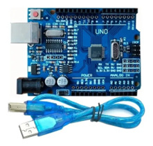

# INFORME Lab. 1	
15/07/202

## Integrantes: 
Alejo Sosa, Santiago Müller, Maira Liscio y Gonzalo Rementería 

## INTRODUCCIÓN

En este informe se hablará sobre el proyecto a realizar para la materia “Laboratorio 1”, el cual se tratara de una alarma laser, compuesta de varios componentes como “Arduino”, “puntero laser de 3w”, “buzzer”, ect.

Se intentará conocer y verificar la función y la eficacia de este haciendo énfasis, en  su  diseño  de  circuito  y  el concepto de seguridad en casa o en cualquier institución.

## OBJETIVOS	
* Conocer y aprender el funcionamiento de una alarma laser.
* Verificar la efectividad de la misma.
* Aprender sobre los diferentes metodos de detección o alarmas de seguridad.	 	

## FUENTES DE INSPIRACION PARA NUESTRO PROYECTO.
Nos basamos en la busqueda de un proyecto con base de Arduino que fuera practico para el dia a dia en nuestra vida. 
Pudimos encontrar algunos proyectos ya realizados pero en general pero no encontrabamos la forma en el que fuera funcional para nuestra vida en la actualidad.

## LA PROPUESTA MEJORADA POR PARTE DE NUESTRO EQUIPO	
Nuestra propuesta fue aprovechar los conocimientos dados por nuestra Universidad Blas Pascal, e integrar un Panel de Seguridad con el cual poder integrerar un codigo para activar y desactivar la alarma, con un par de extras para convertirla en un proyecto mas funcional.

## MATERIALES.

* Placa Arduino  $14 usd

* Protoboard $3.80 usd
 
* Puntero láser, módulo KY-008 $2 usd
 
* Sensor fotorresistencia (LDR) $2 usd
 
* Una resistencia de 10 KΩ   $5 usd
  
* Cables  $3 usd
 
* Buzzer activo $3 usd 
 
* Display Lcd 1602 $15 usd
 
* Teclado Matricial $3 usd
 
## OBJETIVOS DE LOS MATERIALES:

El funcionamiento del proyecto consiste en utilizar el calor brindado por el Puntero láser, módulo KY-008 y captado por la  fotorresistencia (LDR) y utilizarlas para monitoriar que siempre la llegada del laser impacte sobre la fotoresistencia. Asi podremos obtener informacion si alguien o algo atraviesa el laser.
La utilización del Buzzer la utilizaremos para que en el momento en el que algo atraviese la alarma, provocar un sonido para alertar sobre el movimiento.
Gracias a el Teclado Matricial y al Display Lcd 1602 logramos realizar el proyecto de una forma más util y posible de usar este producto en el dia a dia, ya que utilizaremos el display para advertir si la alarma esta activada o desactivada, podremos ingresar a traves del teclado matricial un codigo para activar la alarma o cambiarlo.

CONEXIONES DEL PROYECTO: 	
