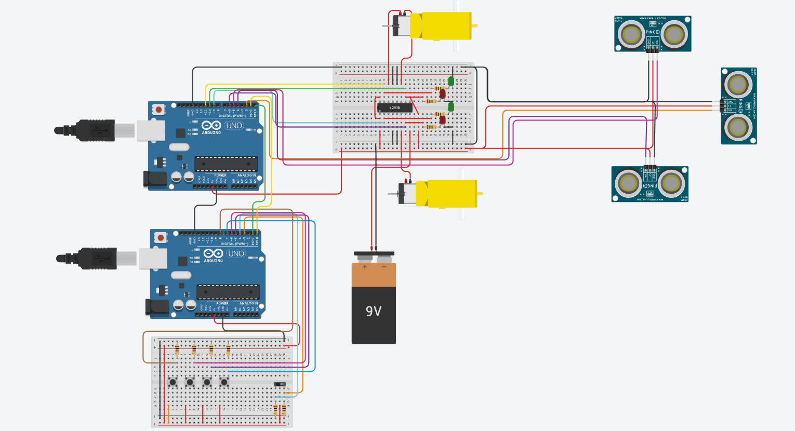

# Aspiradora Robot

## Equipo:
* Godoy Lizzie
* Godoy Santiago
* Juarez Carlos
* Iriarte Jorge

## Inspiración
Para desarrollar  este proyecto nos inspiramos en las necesidades básicas del hogar, es por ello que diseñaremos un robot de tipo doméstico, incorporando funciones  que consideramos innovadoras, al robot convencional. Utilizando “Tinkercad”, un programa de modelado 3D en línea gratuito que se ejecuta en un navegador web. Alli desarrollaremos el diseño, circuito y código de programación del robot.

Nuestro objetivo es crear un robot didáctico, que cumpla con una serie de requisitos tales como: ser ampliable, programable y autónomo. El modelo de robot que tomamos como inspiración es el aspirador domestico.

El funcionamiento de un robot aspirador se basa principalmente en el empleo de sensores. Estos se encargan de detectar los obstáculos de cualquier habitación, es decir, muebles, electrodomésticos, paredes, etc., para no quedarse atascados al encontrarlos. Algunos modelos simplemente funcionan por camino recto.

## Antecedentes
Roomba es un aspirador robótico fabricado y vendido por iRobot. Se lanzó al mercado en 2002, y se calcula que en febrero de 2014 ya se habían vendido más de 10 millones de unidades en todo el mundo.

El robot aspirador Roomba incluye una serie de sensores (táctiles, ópticos y acústicos, dependiendo de cada serie y modelo) que le permite, entre otras cosas, detectar obstáculos, acumulaciones de residuos en el suelo y desniveles pronunciados tales como escaleras. Utiliza dos ruedas motrices independientes que le permiten ejecutar giros de 360 grados. Adicionalmente, se le puede programar para realizar otras funciones más “creativas” mediante un ordenador y haciendo uso de la denominada "Roomba Open Interface".

*[IMAGEN]*

## Materiales Utilizados
* Arduino MEGA
* Sensores Ultrasónicos (x3)
* Relé
* Regulador de Voltaje step down
* Módulo blueetoth HC-06
* Controlador de motores L293D
* Protoboard
* Ventilador 12V 60mm
* Motor DC 3V-6V con ruedas (x2)
* Pilas recargables 18650 (x4)
* Porta pilas dobles (x2)
* Rueda "loca"
* Botella pequeña ~500mL
* Base de madera

## Armado

En primer lugar se plasmó la idea en tinkercad, para una aproximación al circuito, código y comportamiento que se pretendía. Se comenzó desde lo más básico, hasta lo más complejo. Primero se intentó solamente con una rueda y un sensor, probando cómo funciona cada parte y cómo se relacionan en conjunto. De esa manera se fue complejizando el circuito hasta la simulación del robot y la aplicación que se simuló con otro arduino comunicándose por puerto serie.

Una vez obtenido el comportamiento que se pretendía, o lo máximo que se puede a través de la simulación, simplemente se procedió a copiar el esquema de conexión, adaptado a los pines disponibles en Arduino MEGA. Lo que se agregó extra al circuito simulado fue el regulador de voltaje, relé, y se sustituyó la comunicación cableada de puerto serie por comunicación por el módulo bluetooth en el puerto Serial3 del Arduino Mega. 

## Conclusión
