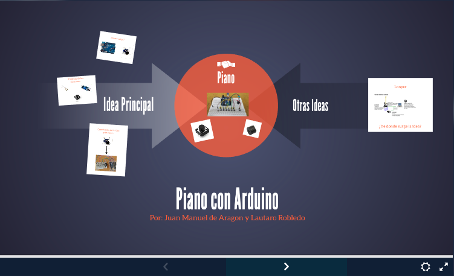
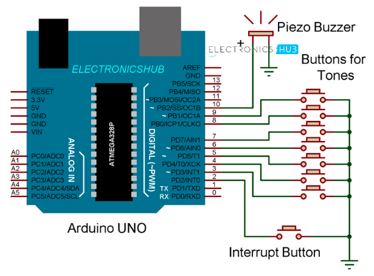

# Ardu-Piano 

## Introducción

Durante el recorrido por la materia, hemos analizado diversas aplicaciones para la tecnología, centrándonos mayormente en la robótica y cómo ésta nos ayuda a facilitar la vida diaria. Un aspecto a tener en cuenta durante la planificación de cualquier proyecto es el de poder encontrar el balance entre calidad, utilidad y accesibilidad (siendo éstos los tres pilares sobre los cuales se debe  fundar cualquier idea). 
Como grupo de estudio, lo que buscamos al definir nuestro proyecto fue intentar buscar afinidades entre los miembros del equipo de trabajo y, desde allí, identificar una necesidad que debíamos satisfacer. Al analizar los intereses compartidos, encontramos la música como un importante aspecto que nos vincula y que nos atrae por la versatilidad de oportunidades que brinda. Asimismo, nos propusimos pensar un proyecto que permitiese crear música a través de la tecnología y extender los horizontes existentes para permitirle a la música evolucionar al ritmo de las nuevas tecnologías. 
Nuestro enfoque para decidirnos sobre el proyecto en cuestión fue analizar la dificultad económica que implica hoy en día poder desarrollarse en el mundo de la música. Analizando el mercado actual, identificamos que uno de los instrumentos más “modernos” utilizado en música (el piano eléctrico de sonidos pregrabados) tienen costos que exceden las posibilidades económicas de los músicos.  Es así que nos percatamos de la posibilidad de poder crear una versión simplificada del instrumento, a un precio considerablemente menor, utilizando Arduino. Así nace nuestro proyecto: “Piano Arduino”.

## ¿Cómo hacer un piano en Arduino?

En vez de preguntarnos cómo hacer el circuito, debemos preguntarnos cómo realizar los sonidos, siendo esto la clave de todo el proyecto. A esto lo realizaremos teniendo en cuenta que Arduino nos permite producir señales PWM. La modulación por ancho de pulsos (también conocida como PWM, siglas en inglés de pulse-width modulation) de una señal o fuente de energía es una técnica en la que se modifica el ciclo de trabajo de una señal periódica (una senoidal o una cuadrada, por ejemplo), ya sea para transmitir información a través de un canal de comunicaciones o para controlar la cantidad de energía que se envía a una carga. Con esta función se generarán diversos tonos.

## Diseño del proyecto

### Diagrama del circuito

### Componentes necesarios

- Arduino UNO
- 8 botones piezoeléctricos
- Un buzzer o parlante capaz de captar las frecuencias
- Tablero de circuitos
- Una fuente de energía; ya sea inalámbrica o conectada a otra fuente.

### Descripción del circuito

El diseño del circuito no representa ninguna dificultad ni complejidad alguna.
La base del mismo sería conectar del Buzzer de 5v la terminal positiva al pin 10 de la placa Arduino. Es necesario conectar el Buzzer a uno de los pines de la placa que permita el soporte de PWM. La otra parte del Buzzer va conectada al GND.
Más adelantes, es necesario conectar 7 botones push a través de los pines 3 al 9 de la placa. Cada uno de estos botones poseerá uno de los sonidos predeterminados desarrollados en el código.
Por último, conectamos el botón número 8, el cual funcionará como repetidor de los sonidos ya seleccionados anteriormente. 

## Funcionamiento

Luego de realizar todas las conexiones de la manera desarrollada en los puntos anteriores, es necesario saber cómo funciona este producto.
Cada uno de los siete botones principales representa uno de los sonidos predeterminados, cada uno representando una nota en la escala musical. No es necesario presionar estos botones en alguna secuencia en particular, la intención de este proyecto es poder realizar combinaciones varias entre ellas para obtener nuevos resultados cada vez que finalizamos. El octavo botón tiene como funcionamiento el poder reproducir todos los sonidos previamente combinados, teniendo en cuenta el tiempo de espera entre botón y botón,así como el orden de los mismos.
Luego de presionar el octavo botón existen dos posibilidades, una sería el volver a reproducir el sonido realizado, o la segunda volver a presionar una combinación de los siete botones principales. 

## Conclusión

Al finalizar este emprendimiento que realizamos durante todo un año, llegamos a la conclusión que mediante esfuerzo y dedicación es posible llegar a obtener resultados óptimos que permiten expandir los horizontes de cualquier ámbito. Más allá del área en la que uno desee especializarse, está claro que la tecnología abre nuevos caminos y ayuda a disminuir costos sin que la calidad disminuya. 
